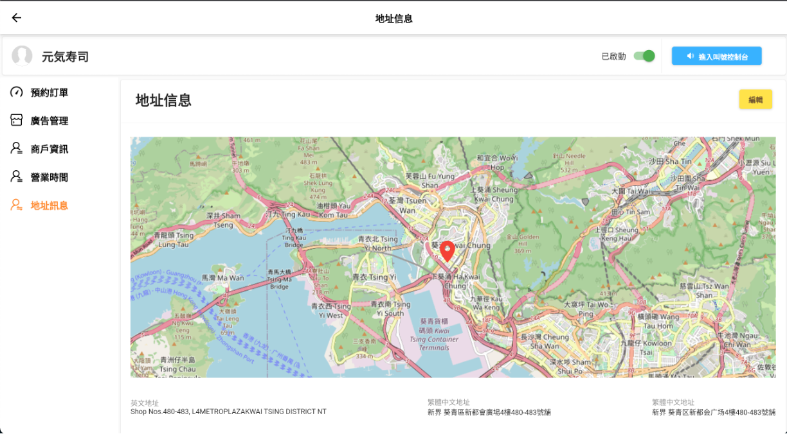

# CMS 前端


***這個 Module 只提供前端服務，若要使用請搭配後端服務並與對應API連接***

## Demo





## Table of Contents

- [Introduction](#introduction)
- [Install](#install)
- [Parameter](#parameter)
- [API](#api)
  - [getMeauData](#getMeauData)
  - [getMeauHaederIconAPI](#getMeauHaederIconAPI)
  - [getProfileImageAPI](#getProfileImageAPI)
  - [getdataTableColumnTypeAPI](#getdataTableColumnTypeAPI)
  - [login](#login)
  - [dataTableRowDelete](#dataTableRowDelete)
  - [dataTableAddRow](#dataTableAddRow)
  - [dataTableEditRow](#dataTableEditRow)
  - [fileStoreAPI](#fileStoreAPI)
  - [editfileAPI](#editfileAPI)
<!-- - [Todo](#todo) -->


## Introduction

* 此Modoule目前提供登入、DataTable的顯示、搜尋，你可以利用簡單的方式擴充功能，並且只需要更改後端傳輸到前端的資料。


## Install

在下載專安之前，你需要先下載好[flutter](https://flutter.dev/docs/get-started/install).


```sh
$ git https://git.eshf-it.com/fok.alvin/cms-module.git
$ cd ./cms
$ flutter run
```
注意：你必須先選好網頁的模擬器，例如:Chrome.
檢查現有的Devices
```sh
flutter devices
```
指定Devices執行
```sh
flutter run -d <devices-ID>
```
  

## parameter

* 在檔案路徑./cms/shop_admin_module/lib/constants.dart 內，你可以依照參數做介面上的調整。
* constants 檔案主要在調整layouts

| Parameter | Description |
| --- | --- |
| defaultPadding | 整個頁面默認間距 |
| sideMeauTextColor | 左邊菜單欄位文字顏色 |
| sideMeauIconColor | 左邊菜單欄位Icon顏色 |
| sideMeauBackgroudColor | 左邊菜單欄位背景顏色 |
| dashboardScreenBackgroudColor | 右側背景顏色 |
| headerTitleColor | header 標題文字顏色 |
| headerTitleSize | header 標題文字大小 |
| searchFieldBackgroud | 搜尋欄位背景顏色 |
| searchFieldIconBackgroud | 搜尋欄位Icon背景顏色 |
| searchFieldWidth | 搜尋欄位寬度 |
| searchFieldborderSideColor | 搜尋欄位欄位框顏色 |
| searchFieldborderSideWidth | 搜尋欄位欄位框寬度 |
| dataTableBackgroud | dataTable背景顏色 |
| DeleteDiaglogTitle | 刪除警告框標題文字 |
| DeleteDiaglogContent | 刪除警告框內容文字 |
| AddFromTitle | 新增窗口標題文字 |
| FromTextFieldWidth | 新增窗口內容欄位寬度 |
| profileCardBackgroud | 個人資料卡背景顏色 |


## api

  * 大部分的修改在路徑./cms/shop_admin_module/lib/screens/setting/api.dart中。
  * api 檔案主要是在調整API路徑。


## pageSetting

當你創立一個新頁面(你可以直接複製[這裡](https://git.eshf-it.com/fok.alvin/cms-module/-/blob/shop_admin_module/shop_admin_module/lib/screens/main/main_screen.dart)檔案內容並修改)時，你新增頁面資訊必須在getMeauData同時新增相關連結。

```
final pageSetting = [
  {
    "title": "Main",
    "svgSrc": "assets/icons/Search.svg",
    "onPress": MainScreen(),
  },
  {
    "title": "<sideMeauTitle>",
    "svgSrc": "<iconPath>",//reference path: assets/icons
    "onPress": "<PageclassName>",
  },
];
```
新頁面內你需要修改以下內容
```
Expanded(
    // It takes 5/6 part of the screen
    flex: 5,
    child: DashboardScreen(pageName: "<新頁面Title名稱>"))
```


## getMeauHaederIconAPI

getMeauHaederIconAPI
```
Input:getMeauHaederIconAPI
Output:image
```

## getProfileImageAPI

getProfileImageAPI
```
Input:getProfileAPI
Output:image
```


## getdataTableColumnType

這邊是要獲取dataTable column type。

getdataTableColumnTypeAPI
```
Input:pageName, <option>rowData
rowData:提供資料用作搜尋。
Output:
Object 結構
{
  "objectSetting":{
    <setting>
    }
  },
  "data":[
    {<object>}
    {<object>}
    {<object>}
  ]
}
Componment Example:
1.Page
{
  "objectSetting":{
    "objectName":"<title>",
    "objectNumber":4,
    "type":"page",
    "position":{
      "row":0,
      "column":0
    }
  },
  "data":[
    {<object>} 
    {<object>} 
    {<object>}
  ]
}
2.Card
{
  "objectSetting":{
    "objectName":"<title>",
    "objectNumber":<int>,
    "type":"card",
    "position":{
      "row":0,
      "column":0
    }
  },
  "data":[
    {<object>} 
    {<object>} 
    {<object>} 
  ]
}
3.hDatatable&vDatatable
//vDatatable 預設取 dataTable的第0筆資料
{
  "objectSetting":{
    "objectName":"<title>",
    "objectNumber":1,
    "type":"hDatatable" or "vDatatable",
    "position":{
      "row":0,
      "column":0
    },
    "api":"<DataAPI>"
  },
  "data":[
    {<objectData>}
  ]
}

4.objectData
{
  "<objectKey>"=>array(
                "objectSetting" => array(
                    "objectName"=><要顯示的名稱>,
                    "type"=> "downlist",
                    "width"=>0.85,
                    "height"=>1.00,
                    "position"=>array(
                        "row"=>0,
                        "column"=>0,
                    ),
                    "itemType" => "",
                    "helperText"=>"",
                    "read-only" => true,
                    "required" => true,
                    "statusItemList" => ["1"=>"123","實際數值"=>"顯示樣子"],
                    "mutiFile" => false,
                    "display"=>array(
                        "page"=>false,
                        "create"=>true,
                        "edit"=>true,
                    ),
                ),
            ),
...
}
```
Example:
```
NormalFiled
  "username"=>array(
        "objectSetting" => array(
                    "objectName"=>"帳戶名稱",
                    "type"=> "normalFiled",
                    "width"=>0.85,
                    "height"=>1.00,
                    "position"=>array(
                        "row"=>0,
                        "column"=>0,
                    ),
                    "itemType" => "",
                    "helperText"=>"<提示字元>",
                    "read-only" => true,
                    "required" => true,
                    "statusItemList" => [],
                    "mutiFile" => false,
                    "display"=>array(
                        "page"=>true,
                        "create"=>true,
                        "edit"=>true,
                    ),
                ),
            ),  
```

```
passwordFiled
  "password" => array(
                "objectSetting" => array(
                    "objectName"=>"passwordFiled",//title
                    "type"=> "passwordFiled",
                    "width"=>0.85,
                    "height"=>1.00,
                    "position"=>array(
                        "row"=>0,
                        "column"=>1,
                    ),
                    "itemType" => "",
                    "helperText"=>"用作登入的 密碼，最少 8 個含有 大寫、小寫及數字 的字元。",
                    "read-only" => true,
                    "required" => true,
                    "statusItemList" => [],
                    "mutiFile" => false,
                    "display"=>array(
                        "page"=>true,
                        "create"=>true,
                        "edit"=>true,
                    ),
                ),
            ), 
```

```
downlist
  "downlist"=>array(
                "objectSetting" => array(
                    "objectName"=>"downlist",
                    "type"=> "downlist",
                    "width"=>0.85,
                    "height"=>1.00,
                    "position"=>array(
                        "row"=>0,
                        "column"=>0,
                    ),
                    "itemType" => "",
                    "helperText"=>"",
                    "read-only" => true,
                    "required" => true,
                    "statusItemList" => [
                        "enable"=>"啟用",
                        "disable"=>"禁用"
                    ],
                    "mutiFile" => false,
                    "display"=>array(
                        "page"=>false,
                        "create"=>true,
                        "edit"=>true,
                    ),
                ),
            ),
```
```
mutiDownlist
  "mutiDownlist"=>array(
                "objectSetting" => array(
                    "objectName"=>"mutiDownlist",
                    "type"=> "mutiDownlist",
                    "width"=>0.85,
                    "height"=>1.00,
                    "position"=>array(
                        "row"=>0,
                        "column"=>0,
                    ),
                    "itemType" => "",
                    "helperText"=>"",
                    "read-only" => true,
                    "required" => true,
                    "statusItemList" => [
                        "enable"=>"啟用",
                        "disable"=>"禁用"
                    ],
                    "mutiFile" => false,
                    "display"=>array(
                        "page"=>false,
                        "create"=>true,
                        "edit"=>true,
                    ),
                ),
            ),
```

```
status
  "status"=>array(
                "objectSetting" => array(
                    "objectName"=>"status",
                    "type"=> "status",
                    "width"=>0.85,
                    "height"=>1.00,
                    "position"=>array(
                        "row"=>0,
                        "column"=>0,
                    ),
                    "itemType" => "",
                    "helperText"=>"",
                    "read-only" => true,
                    "required" => true,
                    "statusItemList" => [
                        "enable"=>"啟用",
                        "disable"=>"禁用"
                    ],
                    "mutiFile" => false,
                    "display"=>array(
                        "page"=>false,
                        "create"=>true,
                        "edit"=>true,
                    ),
                ),
            ),
```

```
icon_path
  "icon_path"=>array(
                "objectSetting" => array(
                    "objectName"=>"icon_path",
                    "type"=> "icon_path",
                    "width"=>0.85,
                    "height"=>1.00,
                    "position"=>array(
                        "row"=>0,
                        "column"=>0,
                    ),
                    "itemType" => "",
                    "helperText"=>"",
                    "read-only" => true,
                    "required" => true,
                    "statusItemList" =>null,
                    "mutiFile" => false,
                    "display"=>array(
                        "page"=>false,
                        "create"=>true,
                        "edit"=>true,
                    ),
                ),
            ),
```


```
EmailPicker
"email"=>array(
                "objectSetting" => array(
                    "objectName"=>"email",
                    "type"=> "email",
                    "width"=>0.85,
                    "height"=>1.00,
                    "position"=>array(
                        "row"=>0,
                        "column"=>0,
                    ),
                    "itemType" => "",
                    "helperText"=>"",
                    "read-only" => true,
                    "required" => true,
                    "statusItemList" => [],
                    "mutiFile" => false,
                    "display"=>array(
                        "page"=>true,
                        "create"=>true,
                        "edit"=>true,
                    ),
                ),
            ),
```
```
PhonePicker
"phone"=>array(
                "objectSetting" => array(
                    "objectName"=>"phone",
                    "type"=> "phone",
                    "width"=>0.85,
                    "height"=>1.00,
                    "position"=>array(
                        "row"=>0,
                        "column"=>0,
                    ),
                    "itemType" => "",
                    "helperText"=>"",
                    "read-only" => true,
                    "required" => true,
                    "statusItemList" => [],
                    "mutiFile" => false,
                    "display"=>array(
                        "page"=>true,
                        "create"=>true,
                        "edit"=>true,
                    ),
                ),
            ),
```

```
countrycode
"countrycode"=>array(
                "objectSetting" => array(
                    "objectName"=>"countrycode",
                    "type"=> "countrycode",
                    "width"=>0.85,
                    "height"=>1.00,
                    "position"=>array(
                        "row"=>0,
                        "column"=>0,
                    ),
                    "itemType" => "",
                    "helperText"=>"",
                    "read-only" => true,
                    "required" => true,
                    "statusItemList" => [],
                    "mutiFile" => false,
                    "display"=>array(
                        "page"=>true,
                        "create"=>true,
                        "edit"=>true,
                    ),
                ),
            ),
```

```
group
"group"=>array(
                "objectSetting" => array(
                    "objectName"=>"group",
                    "type"=> "group",
                    "width"=>0.85,
                    "height"=>1.00,
                    "position"=>array(
                        "row"=>0,
                        "column"=>0,
                    ),
                    "item"=>array(
                        "group1"=>array(
                            "objectSetting" => array(
                                "objectName"=>"group1",
                                "type"=> "normalFiled",
                                "width"=>0.85,
                                "height"=>1.00,
                                "position"=>array(
                                    "row"=>0,
                                    "column"=>0,
                                ),
                                "itemType" => "",
                                "helperText"=>"",
                                "read-only" => true,
                                "required" => true,
                                "statusItemList" => [],
                                "mutiFile" => false,
                                "display"=>array(
                                    "page"=>true,
                                    "create"=>true,
                                    "edit"=>true,
                                ),
                            ),
                        ),
                        "group2"=>array(
                            "objectSetting" => array(
                                "objectName"=>"group2",
                                "type"=> "group",
                                "width"=>0.85,
                                "height"=>1.00,
                                "position"=>array(
                                    "row"=>0,
                                    "column"=>0,
                                ),
                                "itemType" => "",
                                "helperText"=>"",
                                "read-only" => true,
                                "required" => true,
                                "statusItemList" => [],
                                "mutiFile" => false,
                                "display"=>array(
                                    "page"=>true,
                                    "create"=>true,
                                    "edit"=>true,
                                ),
                            ),
                        ),
                    ),
                    "itemType" => "",
                    "helperText"=>"",
                    "read-only" => true,
                    "required" => true,
                    "mutiFile" => false,
                    "display"=>array(
                        "page"=>false,
                        "create"=>true,
                        "edit"=>true,
                    ),
                ),
            ),
```

```
TimePicker
"timePicker"=>array(
                "objectSetting" => array(
                    "objectName"=>"TimePicker",
                    "type"=> "time",
                    "width"=>0.85,
                    "height"=>1.00,
                    "position"=>array(
                        "row"=>0,
                        "column"=>0,
                    ),
                    "itemType" => "",
                    "helperText"=>"用作登入的 用戶名，最少 3 個字元。",
                    "read-only" => true,
                    "required" => true,
                    "statusItemList" => [],
                    "mutiFile" => false,
                    "display"=>array(
                        "page"=>true,
                        "create"=>true,
                        "edit"=>true,
                    ),
                ),
            ),
```
```
DatePicker
"date"=>array(
                "objectSetting" => array(
                    "objectName"=>"date",
                    "type"=> "date",
                    "width"=>0.85,
                    "height"=>1.00,
                    "position"=>array(
                        "row"=>0,
                        "column"=>0,
                    ),
                    "itemType" => "",
                    "helperText"=>"用作登入的 用戶名，最少 3 個字元。",
                    "read-only" => true,
                    "required" => true,
                    "statusItemList" => [],
                    "mutiFile" => false,
                    "display"=>array(
                        "page"=>true,
                        "create"=>true,
                        "edit"=>true,
                    ),
                ),
            ),
```
```
ColorPickerDemo
"color"=>array(
                "objectSetting" => array(
                    "objectName"=>"color",
                    "type"=> "color",
                    "width"=>0.85,
                    "height"=>1.00,
                    "position"=>array(
                        "row"=>0,
                        "column"=>0,
                    ),
                    "itemType" => "",
                    "helperText"=>"用作登入的 用戶名，最少 3 個字元。",
                    "read-only" => true,
                    "required" => true,
                    "statusItemList" => [],
                    "mutiFile" => false,
                    "display"=>array(
                        "page"=>true,
                        "create"=>true,
                        "edit"=>true,
                    ),
                ),
            ),
```

```
DateTimePicker
"datetime"=>array(
                "objectSetting" => array(
                    "objectName"=>"datetime",
                    "type"=> "datetime",
                    "width"=>0.85,
                    "height"=>1.00,
                    "position"=>array(
                        "row"=>0,
                        "column"=>0,
                    ),
                    "itemType" => "",
                    "helperText"=>"用作登入的 用戶名，最少 3 個字元。",
                    "read-only" => true,
                    "required" => true,
                    "statusItemList" => [],
                    "mutiFile" => false,
                    "display"=>array(
                        "page"=>true,
                        "create"=>true,
                        "edit"=>true,
                    ),
                ),
            ),
```
Position說明
```
row 相同會在同一個row
Example:
---------------------
|  00    |    01    | 
---------------------
|  10    |    11    | 
--------------------- 
row 相同 column相同 會在同一個row，以及同個位置。
---------------------
|  00    |    01    |
|        |    01    |
---------------------
|  10    |    11    | 
--------------------- 
card類型內包page可以排版元件，不然預設元件只用row區分。
```

## login

這裡要去後端驗證account和Password。
```
input:
{username: <String>, password: <String>}
```


## dataTableRowDelete
```
Input:
{tableName: <String>, data: <Json>}
Output:
{success: true or false,... }
```

## dataTableAddRow
```
這裡是要把tableName和row傳到後端去做新增
Input:
{tableName: <String>, data: <Json>}
Output:
{success: true or false,... }
```


## dataTableEditRow
```
Input:
{tableName: <String>, data: <Json>}
Output:
{success: true or false,... }
```


## fileStoreAPI
```
Input:
input:{file:<file>,filename:<String>,user:<Json>}
Output:
// output:{
//     "success": true,
//     "message": "File successfully uploaded",
//     "user": null
// }
```


## editfileAPI
```
Input:
input:{table:<String>,column:<String>,user:<Json>}
// output:{
//     "success": true or false
//     "files": [] or [<String>,<String>]
// }
```
<!-- ## Todo -->


